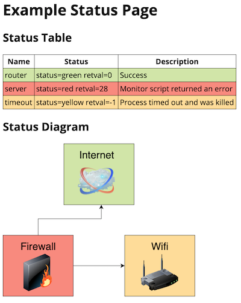
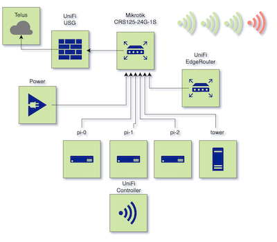

# stylus

**Stylus** (_style + status_) is a lightweight status page for home infrastructure. Configure a set of bash scripts that test
the various parts of your infrastructure, set up HTML/SVG with a diagram of your network, and stylus will
generate you a dynamic stylesheet to give you a visual overview of the current state.

## Running

```
brew install deno
deno run --unstable --allow-net --allow-read --allow-run src/main.ts example/config.yaml
```

## Theory of operation

**Stylus** acts as a webserver with special endpoints and a status monitoring tool.

The status monitoring portion is based around scripts, written in any shell scripting language you like. Each
script is run on an interval, and if the script returns `0` that is considered "up" for a given service. If the
service times out, or returns a non-zero error this is considered a soft ("yellow") or hard ("red") failure.

The special endpoints available on the webserver are:

  * `/style.css`: A dynamically generated CSS file based on the current
  * `/status.json`: A JSON representation of the current state

The `style.css` endpoint may be linked by a HTML or SVG file served from the `static` directory that is configured. If
desired, the HTML page can dynamically refresh the CSS periodically using Javascript. See the included example for a
sample of how this might work.

## Configuration

Example configuration for a status page. This configuration attaches metadata to the various states and has
selectors that apply to both and HTML (for a status table) and CSS (for a status SVG image).

```
version: 1
server:
  port: 8000
  static: static/

monitor:
  dir: monitor.d/

css:
  # Arbitrary metadata can be associated with the three states
  metadata:
    red:
      color: "#fa897b"
    yellow:
      color: "#ffdd94"
    green:
      color: "#d0e6a5"
  rules:
    # Multiple CSS rules are supported
    - selectors: "#${monitor.config.id}"
      declarations: "
        background-color: ${monitor.status.metadata.color} !important;
      "
```

The monitors are configured by creating a subdirectory in the monitor directory (default `monitor.d/`) and
placing a `config.yaml` in that monitor subdirectory.

```
test:
  interval: 60s
  timeout: 30s
  script: test.sh
```

## Screenshots

### Included example



### My personal network


